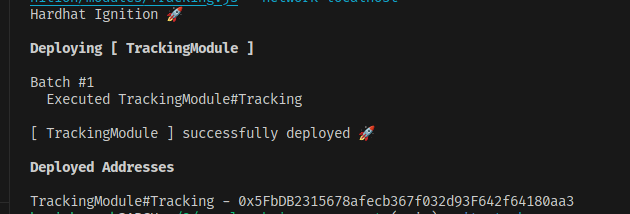
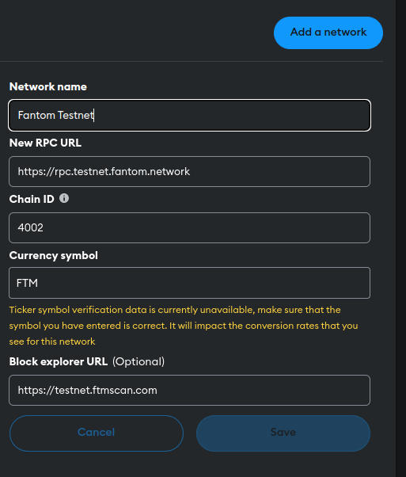

# Deploying Smart Contracts to Ethereum: Localhost and Testnets

## Introduction

Deploying smart contracts is essential for running them on the Ethereum blockchain. This guide covers deployment to both a local development environment ("localhost") and public testnets.

## Prerequisites

- **Node.js and npm (or yarn):** JavaScript runtime and package manager ([Node.js](https://nodejs.org/))
- **Development Framework (Hardhat or Truffle):** Provides tools for compiling, deploying, and testing smart contracts. We'll focus on Hardhat.
- **MetaMask:** Cryptocurrency wallet as a browser extension ([MetaMask](https://metamask.io/))
- **Testnet Ether:** Obtain free Ether for testnets from faucets (e.g., fantom faucet: [Fantom Faucet](https://faucet.fantom.network/)).

## 1. Setting Up Your Project

1. **Create a directory:**

   ```bash
   mkdir my-smart-contract
   cd my-smart-contract
   ```

2. **Initialize Hardhat:**
   ```bash
   npx hardhat
   ```
   - Choose "Create a basic sample project" and press enter for other defaults.

## 2. Writing Your Smart Contract

1.  **Create a file named `Tracking.sol` in the `contracts` directory.**

2.  **Write your Solidity code (example):**
    <details>
    <summary>Smart Contract example</summary>
        ```solidity
        // SPDX-License-Identifier: MIT
        pragma solidity ^0.8.24;

        contract Tracking {
        enum ShipmentStatus { PENDING, IN_TRANSIT, DELIVERED }

            struct Shipment {
                address sender;
                address receiver;
                uint256 pickupTime;
                uint256 deliveryTime;
                uint256 distance;
                uint256 price;
                ShipmentStatus status;
                bool isPaid;
            }

            mapping(address => Shipment[]) public shipments;
            uint256 public shipmentCount;

            // Functions omitted for brevity...
        }
        ```

    </details>

## 3. Compiling Your Contract

```bash
npx hardhat compile
```

## 4. Deploying to Localhost

1. **Start a local Hardhat node:**

   ```bash
   npx hardhat node
   ```

   - Keep this terminal window open.

2. **Ignition File:** Create a file named `Tracking.js` in the `ignition/modules` directory:

   ```javascript
   const { buildModule } = require('@nomicfoundation/hardhat-ignition/modules');

   module.exports = buildModule('TrackingModule', (m) => {
     const trackingContract = m.contract('Tracking');

     return { trackingContract };
   });
   ```

3. **Run the deploy script:**

   ```bash
   npx hardhat ignition deploy ./ignition/modules/Tracking.js --network fantomtest
   ```

   - We will get the following output with the contract address
     

## 5. Deploying to a Testnet (e.g., fantom)

1. **MetaMask setup:**

   - Install MetaMask.
   - Switch to the Fantom testnet.
   - If Not present add the network with the following config

     

   - Get testnet Ether from a faucet : [link](https://faucet.fantom.network/).
   - You need to provide the wallet address to get test ether

2. **Project configuration (`hardhat.config.js`):**

   ```javascript
   require('@nomicfoundation/hardhat-toolbox');
   require('@nomicfoundation/hardhat-ignition');
   require('@nomicfoundation/hardhat-ethers');
   require('dotenv').config();

   // ... other config

   module.exports = {
     solidity: '0.8.24',
     networks: {
       fantomtest: {
         url: process.env.PROVIDER_URL,
         accounts: [`0x${process.env.PRIVATE_KEY}`],
       },
     },
   };
   ```

   - Replace placeholders with your `provider url` and MetaMask `private key`.
   - Create `.env` file taking reference from `.env.example` and provide the update values

3. **Ignition File (same as before)**

4. **Run the deploy script:**

   ```bash
   npx hardhat ignition deploy ./ignition/modules/Tracking.js --network fantomtest
   ```

## 6. Interacting with Your Contract

- **Hardhat console:** `npx hardhat console --network <network_name>`
- **Web3.js or Ethers.js in a frontend application.** : For this we need Smart contract address and the abi json file
