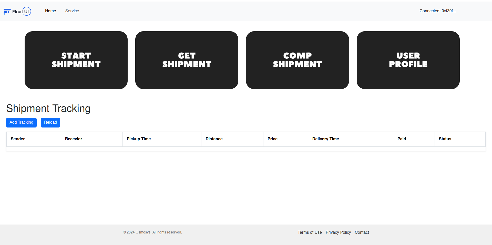

# Application Methods

The application provides the following methods:

## Add Shipment Tracking

Upon clicking the "Add Tracking" button, the following modal will open:

- Fill out the receiver address for the shipment.
- Specify the pickup date.
- Specify the distance.
- Specify the price.

After clicking the submit button, the tracking record will appear in the tracking table:

## Start Shipment

When clicking the "Start Shipment" button, the following modal will appear:

- Fill out the receiver address and the index of the shipment. Here, we want to start the shipment at index 0.
- Upon clicking the save button, a pop-up from MetaMask will prompt to confirm the transaction:

  

- Click on the Reload button to update the tracking table
- After confirmation, the tracking record will display the updated information, with the status changed to "IN_TRANSIT":

  

## Get Shipment

Clicking the "Get Shipment" button will open the following modal:

- Provide the index of the shipment you want to get information about.
- Here, we provided index `0`, and the information for that shipment is displayed.

## Complete Shipment

Clicking the "Complete Shipment" button will open the following modal:

- Provide the receiver address and the index of the shipment you want to mark as complete.
- Upon clicking the "Complete Shipment" button, a pop-up from MetaMask will appear to confirm the transaction:

  

- After confirmation, the record is updated in the backend. To get the latest data, click on the reload button above the tracking table.
- The updated table will display the status updated to "Delivered" along with the updated Delivery Timestamp:

  

## User Profile

Clicking on the "User Profile" button will open the following modal:

This displays the user's balance and the shipment count for the user.
